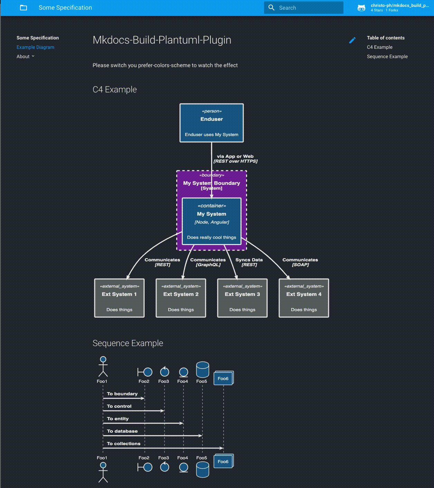
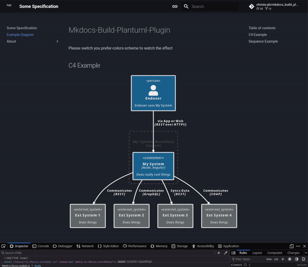

# MkDocs-Build-Plantuml-Plugin

## Table of Contents

- [About the Project](#about-the-project)
- [Prerequisites](#prerequisites)
- [Installation](#installation)
- [Usage](#usage)
- [Dark Mode Support](#dark-mode-support)
- [Known restrictions](#known-restrictions)
- [Contributing](#contributing)

## About the Project

This plugin automates the generation of PlantUML image files when using `mkdocs serve`.

The motivation behind this plugin is to provide a solution for users who prefer not to use inline diagrams and have encountered challenges with non-functional !includes.

**Note**: If you want inline diagrams in your Markdown files

````markdown
```plantuml
Alice -> Bob
```
````

this plugin does _not_ meet your requirements. Please check out [plantuml-markdown](https://github.com/mikitex70/plantuml-markdown) which does exactly that.

## Prerequisites

You need to have installed:

- Python3 (>= 3.12)
- [MkDocs](https://www.mkdocs.org)
- Java for Plantuml (If running locally)
- [Plantuml](https://plantuml.com) (if running locally)
- This plugin (needs [httplib2](https://pypi.org/project/httplib2/) for server rendering)

On macOS you can install plantuml with homebrew which puts a plantuml executable in `/usr/local/bin/plantuml`.

## Installation

```shell
pip3 install mkdocs-build-plantuml-plugin
```

## Usage

### Plugin Settings

Plugin settings are defined by adding `build_plantuml` to the `plugins` list in `mkdocs.yml`.

> **Note**: All settings are optional and can be ommited, at which point the plugin will utilize the default values listed in the tables below.

```yaml
plugins:
  - search: {}
  - build_plantuml:
      render:                             ['local'|'server']
      bin_path:                           Path
      server:                             URL
      disable_ssl_certificate_validation: [true|false]
      output_format:                      ['png'|'svg'|'txt'|'latex'|'pdf']
      allow_multiple_roots:               [true|false]
      diagram_root:                       Path or Path List (must be in mkdocs 'docs_dir')
      output_folder:                      Path (in 'diagram_root')
      input_folder:                       Path (in 'diagram_root')
      input_extensions:                   List (Comma Separated)
      prettify_svg:                       [true|false] (SVG Only)
```

#### Common Options

These options apply to both `server` and `local` rendering modes.

| Setting                | Description                                           | Value                                               | Default Value                      |
|------------------------|-------------------------------------------------------|-----------------------------------------------------|------------------------------------|
| `render`               | Where the image is processed                          | [`local`\|`server`]                                 | `server`                           |
| `diagram_root`         | Root directory for diagrams                           | Path or Path List (must be in mkdocs `docs_dir`)    | `docs/diagrams`                    |
| `output_folder`        | Directory to save the output files                    | Path (in `diagram_root`)                            | `out`                              |
| `input_folder`         | Directory to read the input files                     | Path (in `diagram_root`)                            | `src`                              |
| `output_format`        | PlantUML rendering output format                      | [`png`\|`svg`\|`txt`\|`latex`\|`pdf`]               | `png`                              |
| `allow_multiple_roots` | Allow multiple diagram roots                          | [`true`\|`false`]                                   | `false`                            |
| `input_extensions`     | Comma-separated list of file extensions to parse      | List (Comma Separated)                              | `""` (empty, all extensions are parsed) |
| `prettify_svg`         | Pretty print the SVG XML file content                 | [`true`\|`false`]                                   | `false`                            |

#### Server Options

The following options are available only when `render` is set to `server`, otherwise they are ignored.

| Setting                              | Description                          | Value             | Default Value                      |
|--------------------------------------|--------------------------------------|-------------------|------------------------------------|
| `server`                             | URL of the PlantUML server           | URL               | `http://www.plantuml.com/plantuml` |
| `disable_ssl_certificate_validation` | Disable SSL certificate validation   | [`true`\|`false`] | `false`                            |

#### Local Options

The following options are available only when `render` is set to `local`, otherwise they are ignored.

| Setting        | Description                 | Value | Default Value              |
|----------------|-----------------------------|-------|----------------------------|
| `bin_path`     | Path to the PlantUML binary | Path  | `/usr/local/bin/plantuml`  |

It is recommended to use the `server` option, which is much faster than `local`.

### Example folder structure

This would result in this directory layout:

```python
project_root/                    # Root project directory
├── docs/                        # the default MkDocs docs_dir directory
│   ├── diagrams/
│   │   ├── src/                 # the PlantUML sources
│   │   │   ├── subdir1/
│   │   │   │   └── file1.puml
│   │   │   ├── subdir2/
│   │   │   │   └── # stuff      # subdir2 can have more files or directories
│   │   │   └── file.puml
│   │   ├── include/             # for include files like theme.puml etc (optional, won't be generated)
│   │   │   └── themes/
│   │   │       ├── dark.puml
│   │   │       ├── general.puml
│   │   │       └── light.puml
│   │   └── out/                 # the generated images, which can be included in your md files
│   │       ├── subdir1/
│   │       │   └── file1.svg    # you can organise your diagrams in subfolders, see below
│   │       └── file.svg
├── mkdocs.yml                   # mkdocs configuration file
└── other_project_files/         # Other project-specific files and directories
```

When starting with `mkdocs serve`, it will create all diagrams initially.

Afterwards, it checks if the `*.puml` (or other ending) file has a newer timestamp than the corresponding file in out. If so, it will generate a new image (works also with includes). This way, it won‘t take long until the site reloads and does not get into a loop.

### Including generated images

Inside your `index.md` or any other Markdown file you can then reference any created image as usual:

```markdown
# My MkDocs Document

## Example Plantuml Images


```

## Dark Mode Support

The plugin can now support dark mode when rendering in either `local` or `server` modes.

1. Install a dark theme (ie. for [Material Theme](https://squidfunk.github.io/mkdocs-material/)) 
1. Enable theme support in this plugin:

        - build_plantuml:
            [...]
            theme_enabled: true
            theme_folder: "include/themes"
            theme_light: "light.puml"
            theme_dark: "dark.puml"

1. You have to provide two puml theme files, ie `dark.puml` and `light.puml`
1. In the out directory a `<file>.<ext>` will be created and additionally a `<file>_dark.<ext>`
1. Insert your images in markdown with `` (this selector is then used in the [JS file](example/docs/javascript/images_dark.js) to know which images have to be exchanged)
1. provide [`extra_javascript`](./example/docs/javascript/images_dark.js) file which handles the switch

You can find an example in the [example folder](./example/)

### Example Output



<details>

<summary>LightBox Example</summary>

Running with [mkdocs-glightbox](https://blueswen.github.io/mkdocs-glightbox/)



</details>


## Known restrictions

- If you use `!include` and the `render: "server"` option, this plugin merges those files manually. If there are any issues or side effects because of that, please open a ticket.

## Contributing

Contributions are welcome! If you find any issues or have suggestions for improvements, please open an issue or submit a pull request.
